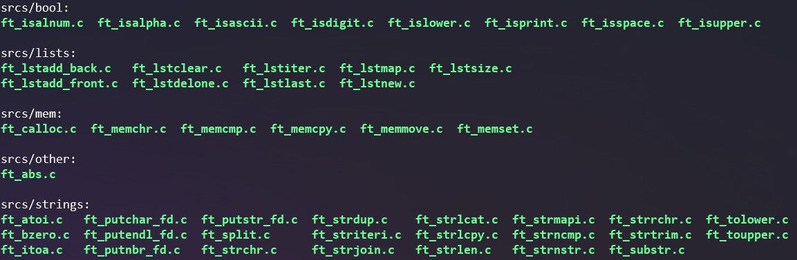

<div align="center">


---
Coded with 💗 by: [mflores-](https://github.com/mariav7)

</div>

# Projects

NOTE: This repository contains three projects in total, all combined to create one comprehensive library for use in future projects.

## Libft

[**Subject PDF**]()

The Libft project focuses on building a personal [C](https://en.cppreference.com/w/c/language) library, which includes recreating standard functions from the [C library](https://cplusplus.com/reference/clibrary/), as well as additional utility functions that can be useful in future 42 projects.

This project served as a foundational exercise in C programming, requiring the implementation of a wide range of functions such as string manipulation, memory allocation, and list management. It encourages a deep understanding of basic data structures and algorithms.

## Ft_printf

[**Subject PDF**]()

The ft_printf project is an introduction to [variadic functions](https://en.cppreference.com/w/c/variadic#:~:text=Variadic%20functions%20are%20functions%20(e.g.,%2C%20...)%3B.) that requires the implementation of our own [printf](https://cplusplus.com/reference/cstdio/printf/) function, which is used for formatted output.

This project challenge involves parsing format strings, managing variable arguments, and formatting output according to the specified format specifiers. It reinforces a strong understanding of string manipulation.

## Get_next_line

[**Subject PDF**]()

The objective of get_next_line is to create a function that reads a line from a [file descriptor](https://en.wikipedia.org/wiki/File_descriptor). It should be able to handle reading from multiple file descriptors without losing the reading thread for any of them.

This project improves file input/output handling skills and reinforces concepts like dynamic memory allocation, learn to manage buffers and handle edge cases.

---

### Library structure

* Libft functions:
<div align="center">
    
</div>

* Get_next_line functions:
<div align="center">
    
</div>

* Ft_printf functions:
<div align="center">
    
</div>

---

## Installation

**Clone repository and compile library:**
```bash
git clone git@github.com:mariav7/libft-gnl-ft_printf_42projects.git
cd libft-gnl-ft_printf_42projects && make
```

**To test the library compile and run:**
```bash
gcc example.c -o example -I./includes/ libft.a
./example
```

---